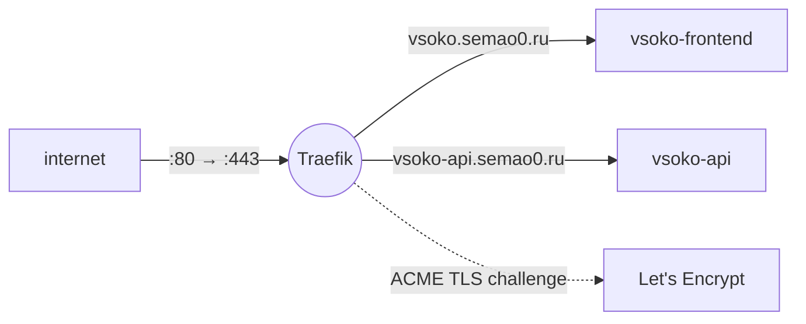

# VSOKO Infra

Traefik reverse proxy with automatic Let's Encrypt TLS and the shared Docker network.

Stack: Traefik, Let's Encrypt, Docker Compose.

## What it does

The entry point on the host, deployed before the apps. Traefik handles HTTPS and
routes requests to the app containers. Apps join the external `web_network` and
declare their routes with Docker labels, so the proxy doesn't need changes when an
app is added or redeployed.



## Features

- **Automatic TLS** — Let's Encrypt certificates via the TLS challenge (resolver `semao0resolver`), stored in `letsencrypt/acme.json`.
- **HTTPS only** — `web` (`:80`) redirects everything to `websecure` (`:443`).
- **Routing by labels** — Traefik only picks up containers with `traefik.enable=true`.

## Contracts

| What | Value |
| --- | --- |
| Docker network | `web_network` (external, shared by all VSOKO services) |
| Entrypoints | `web` `:80`, `websecure` `:443` |
| Certificate resolver | `semao0resolver` |
| Routes | `vsoko.semao0.ru` → vsoko-frontend, `vsoko-api.semao0.ru` → vsoko-api (set in their compose files) |

## Quick start

```bash
docker network create web_network    # once
docker compose -f proxy/docker-compose.proxy.yml up -d
```

Then start `vsoko-api` and `vsoko-frontend` with their own `docker-compose.yml`.
Traefik picks them up automatically.

## Structure

```text
vsoko-infra/
└── proxy/
    └── docker-compose.proxy.yml   # Traefik
```
