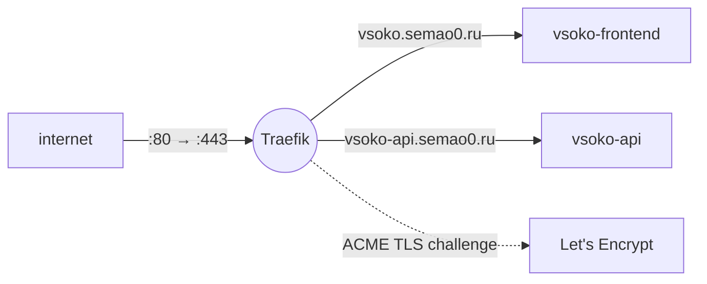

<div align="center">

<a href="https://gitlab.com/vsoko"></a>

# 🏗️ vsoko-infra

### Traefik reverse proxy with automatic Let's Encrypt TLS and the shared Docker network

[](https://gitlab.com/vsoko/vsoko-infra/-/pipelines)


<sub>Part of <a href="https://gitlab.com/vsoko"><b>VSOKO</b></a> — an education quality assessment platform running in production at a university</sub>

</div>

---

## Role in the system

The entry point of the host, deployed before the applications. Traefik terminates HTTPS and routes requests
to the application containers. Those containers join the external network `web_network` and declare their
routes with Docker labels, so the proxy does not change when an application is added or redeployed.



## Features

- **Automatic TLS** — Let's Encrypt certificates via the TLS challenge (resolver `semao0resolver`), stored in `letsencrypt/acme.json`.
- **HTTPS only** — the `web` entrypoint (`:80`) redirects everything to `websecure` (`:443`).
- **Label-based routing** — the Docker provider picks up only containers with `traefik.enable=true`.
- **CI deploy** — GitLab CI copies `proxy/` over SSH, creates `web_network` if missing and restarts Traefik (`stage` → staging, `main` → production).

## Contracts

| What | Value |
| --- | --- |
| Docker network | `web_network` (external, shared by all VSOKO services) |
| Entrypoints | `web` `:80`, `websecure` `:443` |
| Certificate resolver | `semao0resolver` |
| Routes | `vsoko.semao0.ru` → vsoko-frontend, `vsoko-api.semao0.ru` → vsoko-api (declared in their compose files) |

## Quick start

```bash
docker network create web_network    # once
docker compose -f proxy/docker-compose.proxy.yml up -d
```

Then start [vsoko-api](https://gitlab.com/vsoko/vsoko-api) and [vsoko-frontend](https://gitlab.com/vsoko/vsoko-frontend)
from their own `docker-compose.yml`. Traefik discovers them automatically.

## Structure

```text
vsoko-infra/
├── proxy/
│   └── docker-compose.proxy.yml   # Traefik
└── .gitlab-ci.yml                 # SSH deploy of proxy/ to the host
```
